# This is for Django Beginners
High level concept
- URL: Uniform Resource Locator. It is a way to locate a resource on the internet. The resource can be a web page, an image, a video, a PDF, and so on.
- HTTP: Hypertext Transfer Protocol. When a user types a website (URL) into a browser (frontend), a request is sent to the backend of the website (a web server). The server processes the request and returns a response. This kind of data exchange is defined by HTTP. It specifies how clients and servers communicate.
- HTML: Hypertext Markup Language. The backend of a website has two options for responding to clients. The first option is to generate the requested page in HTML format and send it back to the client. The other option is to return only the necessary data for the requested page and let the client build the page. This is considered the best practice.
- API: Application Programming interface. If we push the responsibility of generating web pages to the client, the server becomes a gateway to the data. On the server, we can provide endpoints that client can talk to to get various pieces of data. Such kind of endpoints are called as APIs.

- URL：统一资源定位符（Uniform Resource Locator），它是一种在互联网上定位资源的方式。该资源可以是一个网页、一张图片、一个视频、一个 PDF 文件等等。
- HTTP：超文本传输协议（Hypertext Transfer Protocol）。当用户在浏览器（前端）中输入一个网站地址（URL）时，会向该网站的后端（Web 服务器）发送一个请求。服务器处理这个请求后返回响应。这种数据交换方式由 HTTP 定义，它规定了客户端和服务器之间如何进行通信。
- HTML：超文本标记语言（Hypertext Markup Language）。网站的后端有两种方式可以回应客户端：第一种是生成一个 HTML 格式的页面并将其返回给客户端；第二种是只返回页面所需的数据，由客户端来构建页面。后者被认为是更佳的实践方式。
- API：应用程序编程接口（Application Programming Interface）。如果我们把生成网页的责任交给客户端，那么服务器就变成了数据的入口。在服务器端，我们可以提供一些“端点”（endpoints），供客户端通过这些接口获取各种数据。这类端点被称为 API。


### Setup Environment
```
% python --version
Python 3.12.9
% python -m venv .venv
% source .venv/bin/activate
% pip install Django
```

### Creat Django project
```
% django-admin startproject myproject
% cd myproject
# start server on specific port 8001
% python manage.py runserver 8001
```

- project structure

        .
        ├── myproject
        ├── db.sqlite3
        ├── manage.py
        └── myproject
            ├── __init__.py
            ├── asgi.py
            ├── settings.py
            ├── urls.py
            ├── views.py
            └── wsgi.py
- start page

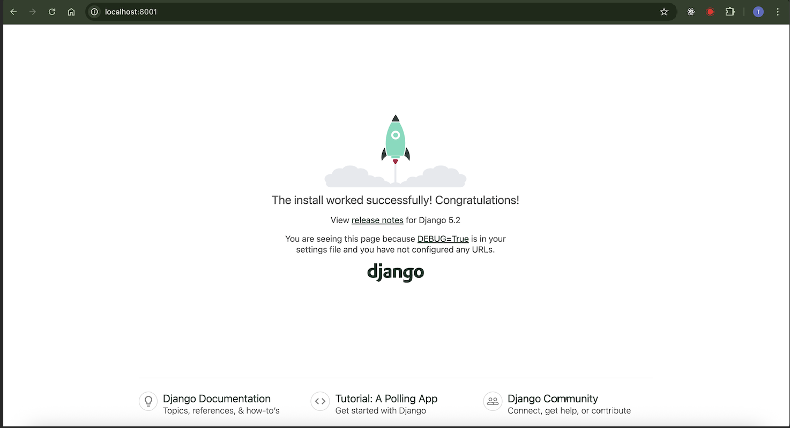

### Create first app
```
% python manage.py startapp myapp
```
Register app in settings:
- `myproject/settings.py`

        INSTALLED_APPS = [
            'django.contrib.admin',
            'django.contrib.auth',
            'django.contrib.contenttypes',
            'django.contrib.sessions',
            'django.contrib.messages',
            'django.contrib.staticfiles',
            'myapp',  # Include your app here
        ]

- project structure:

        .
        ├── myproject
        │   ├── db.sqlite3
        │   ├── manage.py
        │   ├── myapp
        │   │   ├── __init__.py        # 让 Python 把该目录当作模块处理
        │   │   ├── admin.py           # 注册模型以在 Django Admin 后台显示
        │   │   ├── apps.py            # App 的配置类
        │   │   ├── migrations         # 数据库迁移记录
        │   │   │   ├── __init__.py
        │   │   ├── models.py          # 定义数据库模型（数据结构）
        │   │   ├── tests.py           # 编写单元测试和集成测试
        │   │   ├── urls.py            # 定义该 App 的 URL 路由
        │   │   └── views.py           # 处理请求并返回响应（视图逻辑）
        │   └── myproject
        │       ├── __init__.py
        │       ├── asgi.py
        │       ├── settings.py
        │       ├── urls.py
        │       ├── views.py
        │       └── wsgi.py

### Route URLs to views
- urls.py: URL Configuration.(用来配置URL映射的文件, 将URL映射到views functions)
- views.py: Defined functions/classes in views takes an HTTP request as an argument and returns an HTTP response.(接收web请求，返回web响应)

#### views.py samples in app
###### Function Based Views
* `myapp/views.py`: A function view takes a http request and returns a plain text response.
        
        from django.http import HttpResponse
        def hello(request):
            return HttpResponse('Hello, world! This is the hello page of myapp.')

###### Class Based Views
* `myapp/views.py`: A class view takes a http request and returns a plain text response.

        from django.views.generic import TemplateView
        class MyView(TemplateView):
            template_name = 'hello.html'

* `myapp/templates/hello.html`

        <!DOCTYPE html>
        <html>
        <head>
            <title>Home page of myapp</title>
        </head>
        <body>
            <h1>myapp hello world</h1>
        </body>
        </html>


#### urls.py patterns in app
1. For each app, create a `urls.py` to map url to view
2. Mapping url path to view function `myapp/urls.py`:

        from django.urls import path
        from . import views

        urlpatterns = [
            path('hello/', views.hello, name='myapp_hello'), # mapping to function view
            path('', views.MyView.as_view(), name='myapp_myview'), # mapping to class view
        ]

- `'hello/', ''`: str: URL path 
- `views.hello, views.MyView.as_view()`: view function which returns Http Response
- `name='xxx'`: alias for the path, it's used for reference in html

#### urls.py in main project
`myproject/urls.py`:

        from django.contrib import admin
        from django.urls import path, include

        urlpatterns = [
            path('admin/', admin.site.urls),
            # Include the URLs from myapp
            path('myapp/', include('myapp.urls')), 
        ]

start server:

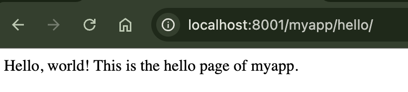
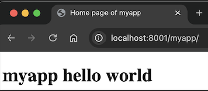

### Tips for debugging Django in VSCode
1. Install python extension

    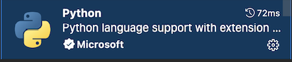

2. Set interpreter

    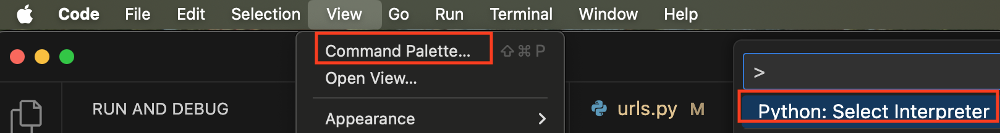
    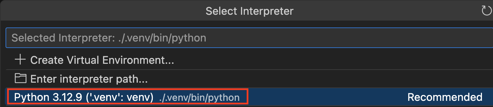

3. Create launch.json for debug

    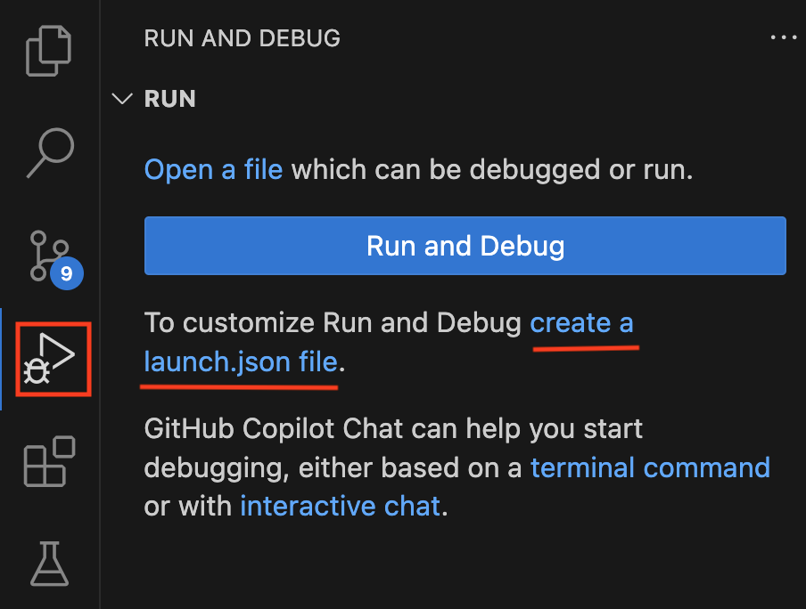
    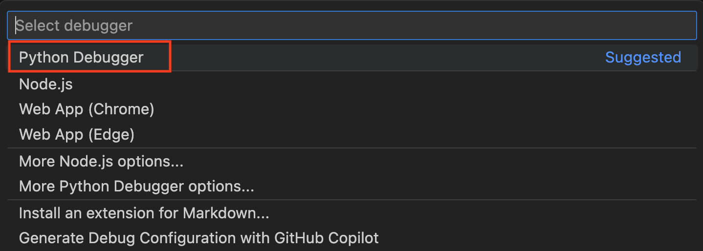
    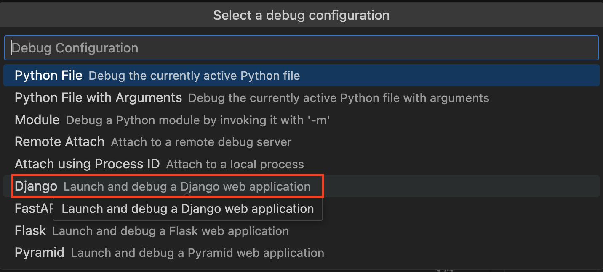
    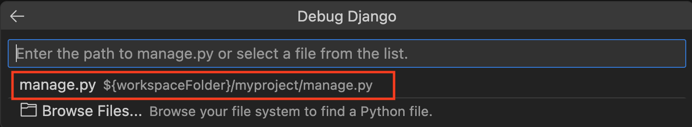

- .vscode/launch.json

        {
            "version": "0.2.0",
            "configurations": [
                {
                    "name": "Python Debugger: Django",
                    "type": "debugpy",
                    "request": "launch",
                    "args": [
                        "runserver",
                        "8001"
                    ],
                    "django": true,
                    "autoStartBrowser": false,
                    "program": "${workspaceFolder}/myproject/manage.py"
                }
            ]
        }
4. RUN AND DEBUG

    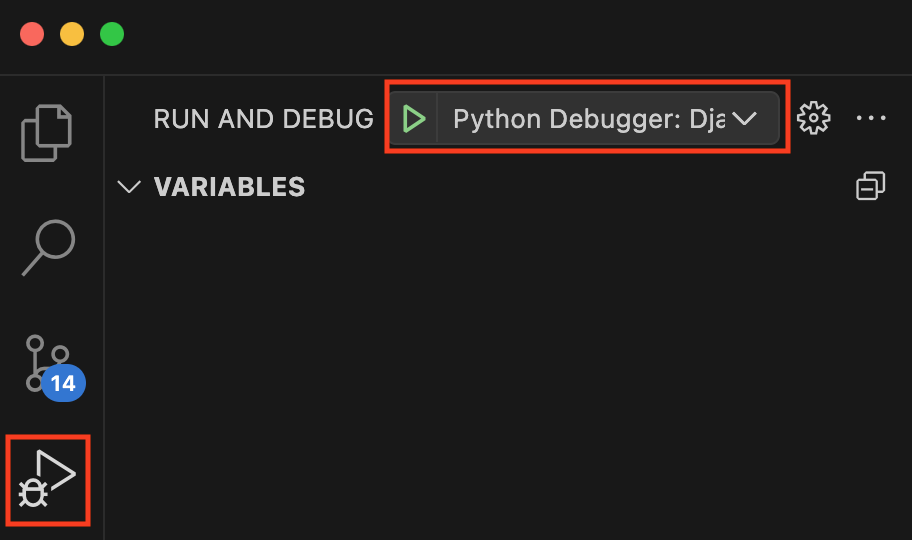

5. Setup Django Debug Toolbar

    `ps: Toolbar only appear when return a proper html document`

    - Install debug toolbar:
        ```
        pip install django-debug-toolbar
        ```
    - Register debug toolbar to the installed apps in `myproject/settings.py`:
        ```
        INSTALLED_APPS = [
        'django.contrib.admin',
        'django.contrib.auth',
        'django.contrib.contenttypes',
        'django.contrib.sessions',
        'django.contrib.messages',
        'django.contrib.staticfiles',
        'myapp',  # Include your app here
        'debug_toolbar',  # Include the debug toolbar
        ]
        ```

    - Setting up URLconf in `myproject/urls.py`:
        ```
        import debug_toolbar
        urlpatterns = [
        ...
        path('__debug__/', include(debug_toolbar.urls)),
        ]
        ```
    - Enabling middleware in `myproject/settings.py`:
        ```
        MIDDLEWARE = [
        'debug_toolbar.middleware.DebugToolbarMiddleware',  # Include the debug toolbar middleware
        ...
        ]
        ```

    - Configure internal ips
    
        The debug toolbar is shown only if your IP address is listed in the `INTERNAL_IPS`

        ```
        INTERNAL_IPS = [
        '127.0.0.1',
        ]
        ```

    Start the server and the toolbar will appear on the right:
    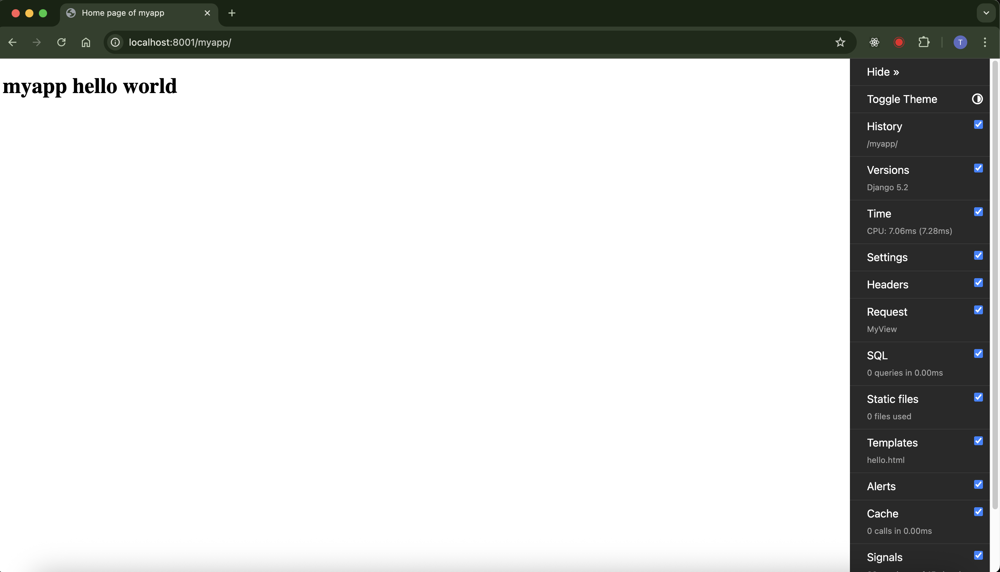


