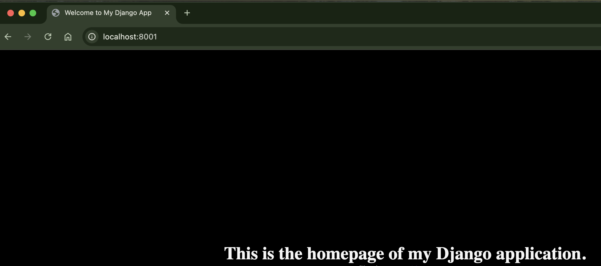
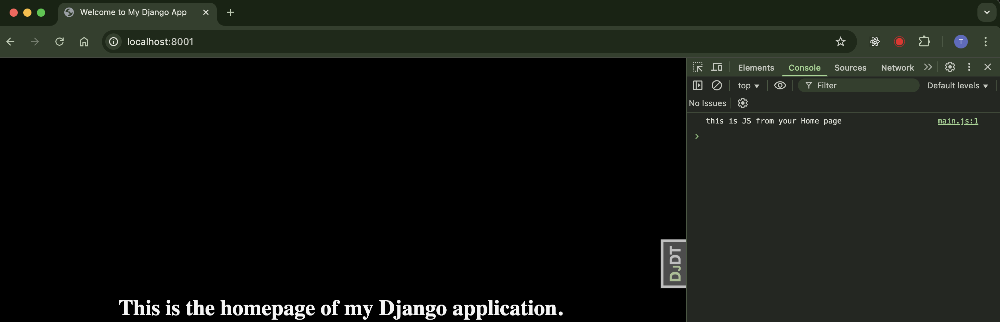
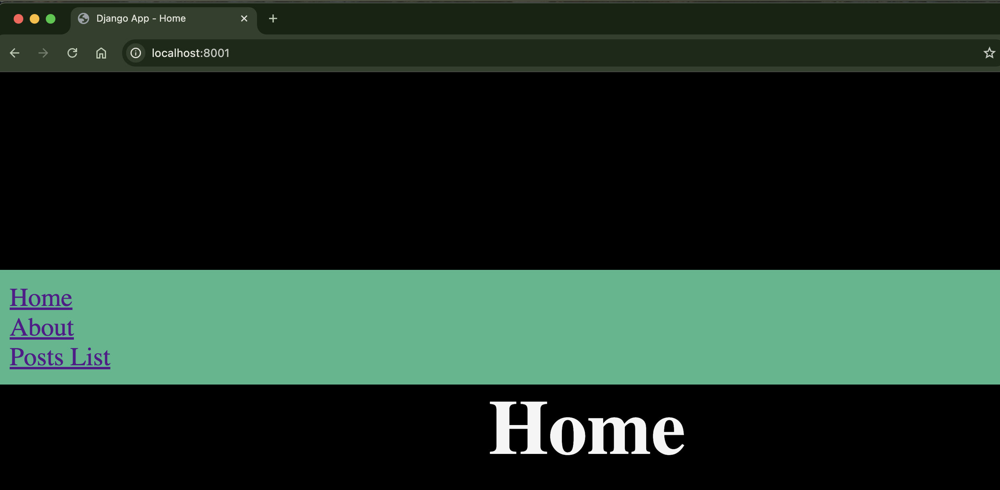
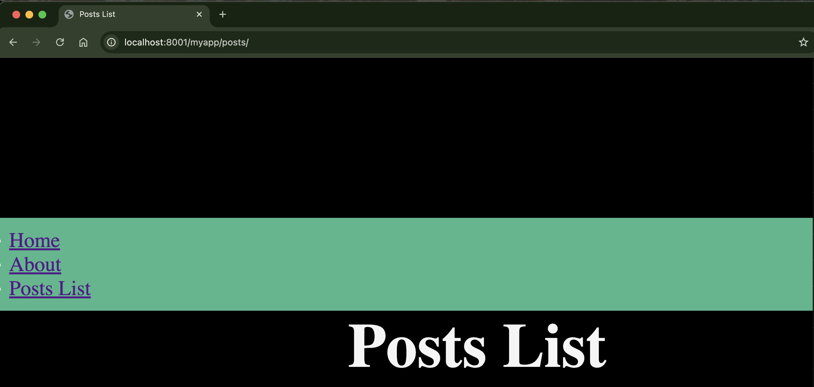

# This is for Django Beginners

### Templates - Views Generating Response based on Templates

* `myproject/views.py`: render the templates

        def homepage(request):
            context = {
                'title': 'Welcome to My Django App',
                'message': 'This is the homepage of my Django application.',
            }
            return render(request, 'home.html', context)
    
    - `request`: http request from user.
    - `home.html`: path of the template. Django looks for templates in `templates/` folder of each installed app. So it's suggested to use format `app_name/template_name.html`. Here we are using additional template directories to show how to configure it. 
    - `context`: data passed to the template.

* `templates/home.html`: A template contains static parts and some special syntax(variables and logic) describing how dynamic content will be inserted.

        <!DOCTYPE html>
        <html lang="en">
        <head>
            <meta charset="UTF-8">
            <meta name="viewport" content="width=device-width, initial-scale=1.0">
             <!-- Check if title is provided -->
                <title>{{ title }}</title>
            
                <title>Home</title>
            
        </head>
        <body>
            <h1>{{ message }}</h1>
        </body>
        </html>

    - use `{{ variable }}` to display variables 
    - use `` to control structure

* `myproject/settings.py`: make sure the additional template dir is added as below:

        TEMPLATES = [
            {
                'BACKEND': 'django.template.backends.django.DjangoTemplates',
                'DIRS': ['templates'],  # Add your templates directory here
                'APP_DIRS': True,
                'OPTIONS': {
                    'context_processors': [
                        'django.template.context_processors.debug',
                        'django.template.context_processors.request',
                        'django.contrib.auth.context_processors.auth',
                        'django.contrib.messages.context_processors.messages',
                    ],
                },
            },
        ]

* `static/css/style.css`: Configure style here

        * {
            margin: 0;
            padding: 0;
            box-sizing: border-box;
        }

        body {
            min-height: 100vh;
            display: grid;
            place-content: center;
            font-size: 1rem;
            background-color: black;
            color: whitesmoke;
        }

        h1, p {
            text-align: center;
        }
* `myproject/settings.py`: tell Django where's the folder for static assets.

        STATIC_URL = 'static/'
        STATICFILES_DIRS = [
            BASE_DIR / "static",
        ]

* `templates/home.html` link style

        <!DOCTYPE html>
        
        <html lang="en">
        <head>
            ...
            <link rel="stylesheet" href="">
        </head>
        ...

* start the server to validate the generated html

    

* Sample to link JavaScript
  - `static/js/main.js` 

        console.log('this is JS from your Home page')

  - `templates/home.html`

        <!DOCTYPE html>
        
        <html lang="en">
        <head>
            ...
            
        </head>
        ...

    defer: wait until all of the page is loaded and then it loads the script

  - validate:

    

#### Summary
1. Prepare data (context) in the view
2. Load the desired template
3. Render the template with the provided context
4. Return the rendered HTML as an HTTP response

### Template inheritance (模版继承)
Template inheritance lets you define a base template with placeholders (called blocks) that can be overridden by child templates. This avoids repetition of code like headers, footers, navigation bars, and other shared UI components.
(模板继承允许我们定义一个带有占位符（称为块）的基础模板，这些块可以在子模板中被覆盖。这避免了像头部、尾部、导航栏和其他共享UI组件的代码重复。)

#### Key Concepts:
- extends: Specifies which template the current one is inheriting from.(指定当前模板继承自哪个模板。)
- block: Defines a section in a template that can be overridden in a child template.(在模板中定义一个可以被子模板覆盖的部分。)

#### Sample

1. Create a base template()
 
    `templates/static/layout.html`

        <!DOCTYPE html>
        
        <html lang="en">
        <head>
            <meta charset="UTF-8">
            <meta name="viewport" content="width=device-width, initial-scale=1.0">
            <title>
                
                    Django App
                
            </title>
            <link rel="stylesheet" href="">
            
        </head>
        <body>
            <nav>
                <ul>
                    <li><a href="/">Home</a></li>
                    <li><a href="/about">About</a></li>
                    <li><a href="/myapp/posts">Posts List</a></li>
                </ul>
            </nav>
            <main>
                
                
        </body>
        </html>

    - It defined 2 blocks: `title`, `content`. These blocks can be overridden in child templates.

2. Child Templates that extends base template

    `templates/home.html`

        
        
        {{ block.super }} - Home
        
        
        <h1>Home</h1>
        

    `myapp/templates/myapp/posts_list.html`

        
        
        Posts List
        
        
        <h1>Posts List</h1>
        

    - `` tells Django to use layout.html as the parent template.
    - `` overrides the title block.
    - `` replaces the default content in the main section.
    - `{{ block.super }}` perserves parent content

    validate by starting server:

     
     

    File structure:

            .
            ├── myproject
            │   ├── myapp
            │   │     ├── templates
            │   │          └── myapp
            │   │              └── posts_list.html
            │   ├── myproject
            │   ├── static
            │   │   ├── css
            │   │   │   └── style.css
            │   │   └── js
            │   │       └── main.js
            │   └── templates
            │       ├── about.html
            │       ├── home.html
            │       └── layout.html

3. Nesting multiple levels of Templates
Sample:
- `base.html` → general layout
- `section_base.html` → extends base.html, defines blocks specific to a section (e.g., blog posts)
- `post_detail.html` → extends section_base.html, adds post-specific content

#### Summary
- :	Used at the top of a template to inherit from another.
- :	Defines a section that can be overridden in child templates.
- {{ block.super }}:	Includes the content of the same block from the parent template.
- Multi-level inheritance:	You can chain multiple layers of templates for advanced organization.

